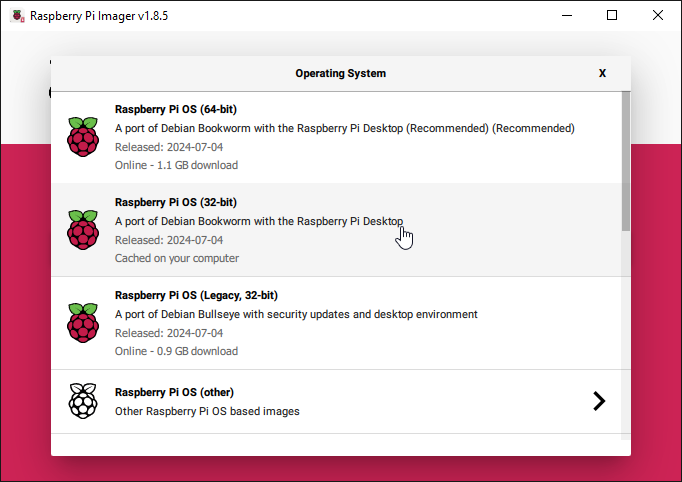

Installing Tracks on Raspberry Pi in 2024
========================

TLDR : [Tracks installation for RPi3B+](https://github.com/FixedCamel/tracks_FC/blob/main/Tracks_RaspberryPi_2024.md#3-software-installation).

## 1. Introduction


After many years looking into productivity solutions I found [Tracks](https://www.getontracks.org/) (Web hosted somewhere) about a decade ago, and used it quite a lot for some time.

Then I stayed away for a few years and when I returned that option was no longer available.

So after exploring the different ways to use it again I finally got it to work on a[ Raspberry Pi 3 Model B+](https://www.raspberrypi.com/products/raspberry-pi-3-model-b-plus/) or **RPi3B+** for short.

Reasons:
1. I didn't want to pay for [Taskitin.fi](https://www.taskitin.fi/) at this point and for the next reason.
2. I am not a fan of someone else having access to my data.
3. The [TurnKey Linux](https://www.turnkeylinux.org/tracks)route had all of the above issues and more. I don't know if it even works at the moment.
4. I tried Docker but faced several issues:
   * I am not a fan of Docker in general. Having to install and run 3 layers really bugs me.
   * I have managed to stay away from Docker and have little experience.
   * Thus the issues I faced with the official [Docker image](https://hub.docker.com/r/tracksapp/tracks) were too much.
   * [Staannoe's Docker image](https://github.com/TracksApp/tracks/wiki/Staannoe%27s-Docker-image) is not available to use anymore.
   * I don't mind having access to Tracks only when my computer is on but having it always running and accessible from any device in my network is pretty cool!

I chose to install from scratch using the official installation instructions for a [Custom Server Installation](https://github.com/TracksApp/tracks/blob/master/doc/installation.md#custom-server-installation).

However I had to make some deviations from those instructions that took quite some time. Some because I didn't know Ruby at all :-) 

I am writing this guide to help my future self, help others and contribute to this awesome project.

None of the links are sponsored.

Kudos to everyone that has contributed so far! Thank you so much!

Looking forward to your feedback to improve this guide.

I am not a software developer but I do have a particular set of skills, and writing this, is actually quite relaxing. Enjoy :-)

---

## 2. Raspberry Pi
### Hardware

I already had a [ Raspberry Pi 3 Model B+](https://www.raspberrypi.com/products/raspberry-pi-3-model-b-plus/) lying around with a 32GB SD card. I have no doubt that you can substitute for newer version and maybe older ones.

Here some parts that I would recommend if I did it all over again:
* [Cool case and power supply](https://www.amazon.com/dp/B07BTHNW9W)
* [Highly recommended SD card for RPi3](https://www.amazon.com/dp/B06XYHN68L)

### Software

RPi3B+ needs the old installation method but now one can use [Raspberry Pi Imager](https://www.raspberrypi.com/software/) .

Using the **Imager** I chose the newest **32bit Raspberry Pi OS with desktop** edited the settings disabling the Pi Remote desktop just because.



Then connect everything and power up. This whole process is pretty straight forward and only took minutes till the Pi desktop appeared. I removed some programs and updated some Pi software.

I highly recommend to check your Pi for throttling using this command in the console.

`vcgencmd get_throttled`

Even an official power supply can fail after many years. Any answer that is not all zeros (0x0) is bad.



Power-up your Pi, connect to the internet and make sure everything looks good!


---

##  3. Software Installation

In the following subsections I present the instructions for installing Tracks on a fresh 32bit Raspberry Pi OS using SQLite3.
I am convinced I over-installed some prerequisites or overused sudo. Depending on feedback I will update this guide.



It's separated in six subsections:
1. Installing Ruby on Rails
2. Installing nodejs & yarn
3. Installing individual gems
4. Editing Tracks Gemfile and Gemfile.lock
5. Tracks installation
6. Starting the server

### Installing Ruby on Rails

I started in the HOME folder and only moved when it was time to clone Tracks.

Update your package handler. This took some minutes:
   1. `sudo apt update`
   2. `sudo apt full-upgrade`
   
   
   [Installing Ruby Debian](https://www.ruby-lang.org/en/documentation/installation/#apt)
   
   sudo apt-get install ruby-full
   
   [The Odin Project]( https://www.theodinproject.com/lessons/ruby-installing-ruby)
   
   
Install ruby and ruby-dev
1. `sudo apt-get install ruby`
2. `sudo apt-get install ruby-dev`

It takes some minutes to finish.

Rails also needs **SQLite3** according to [Getting Started with Rails](https://guides.rubyonrails.org/getting_started.html#creating-a-new-rails-project-installing-rails)
1. `sudo apt install sqlite3`
2. `sqlite3 --version`
I got 3.4 as the version.

Warm up your train got it is finally time to install Rails:
1. `sudo gem install rails`
2. `rails --version`
	gem install rails

This took some minutes	but I got 7.2.1 as the version. That was the end of the good times :-(

I tried **bundle config set without mysql postgresql** & **bundle install** but it kept getting stuck. This was after I installed bundle by itself. I actually let it ran overnight just to be sure for gems like puma, tracks_chartjs_ror and finally libv8-node.

The next 2 subsections help with the above issues. 

### Installing nodejs & yarn

Getting stuck installing the gems above and later getting the error message that it couldn't find yarn finally led me to the path of abandoning **mini_racer** and *therubyracer* and installing *nodejs* as a Linux package. Used the instructions from [Node.js and Raspberry Pi](https://www.w3schools.com/nodejs/nodejs_raspberrypi.asp) and here for [yarn](https://classic.yarnpkg.com/lang/en/docs/install/#windows-stable)

By the way trying to install yarn with apt-get would lead to **cmdtest** being installed. I might have purged it as some point before the following commands with sudo apt-get purge cmdtest.

Running the following commands took some time:
1. `curl -sL https://deb.nodesource.com/setup_18.x | sudo bash -` Here I used the recommended version 18.
2. `sudo apt install nodejs -y`
3. `sudo npm install -g yarn`
4. `yarn global bin`
5. `ls .yarn/bin/`

npm install --global yarn
https://deb.nodesource.com/-->20

The yarn folder is populated with yarn v1.22.22 and that is where command 4 is pointing.

### Installing individual gems

https://www.moncefbelyamani.com/why-you-should-never-use-sudo-to-install-ruby-gems/
https://felipec.wordpress.com/2022/08/25/ruby-stop-using-sudo/

In this subsection I will share what gems I installed individually. Most of my notes are from my early time in this adventure when I didn't know as much about Gemfile and nodejs. I may come back and edit it when I try the installation one more time.

Install the following gems. Some will take seconds, others minutes:
1. `sudo gem install bundler`
2. `sudo gem install puma`
3. `sudo gem install chartjs-ror`
4. `sudo gem install tracks-chartjs-ror`
5.  `sudo gem install bootstrap`
6.  `sudo gem install autoprefixer-rails`
7.   `sudo gem install listen`



#############sudo gem install sass-rails
##############sudo gem install bootstrap-sass
nnnnsudo gem install therubyracer


installed sassc-rails 2.1.0 in seconds after succsfully installing sassc 2.1.0

restarted and sudo gem install sassc --verbose 20 minutes but it instaleld

### Cloning the Tracks repository

Now, lets return to the official instructions and install Tracks in Sites/tracks:
1. `cd ~/Sites` or another folder that you will use to clone Tracks into.
2. `git clone https://github.com/TracksApp/tracks.git`
3. `cd tracks`

### Editing Gemfile and Gemfile.lock

To be laconic, two gems, wrong place, wrong version.

Omitting this fix will give you the dreaded Sprocket error message when trying to precompile.

#### sassc-rails

Many thanks to **habernal** for figuring out the [sassc-ruby issue](https://github.com/TracksApp/tracks/issues/2693).
The solution is to edit the Gemfile and Gemfile.lock to have:
1. In Gemfile move `sassc-rails` line from **group :assets do** upwards just below `gem 'will_paginate'`.
2. Change the version to 2.1.0 so that the line is now `gem 'sassc-rails', '~> 2.1.0'` .
2. In Gemfile.lock near the end or line 378 change the version so that the line in the **DEPENDENCIES** section becomes `sassc-rails (~> 2.1.0)`.
3. I only changed the version in **DEPENDENCIES**.
#### bootstrap-sass

Found the solution in stackoverflow, many thanks to that one person :-)

In the Gemfile:
1. Move `gem 'bootstrap-sass', '3.4.1'` line from **group :assets do** upwards just below `gem 'sassc-rails', '~> 2.1.0'` .

It should look something like this:

```
gem 'tracks-chartjs-ror'
gem 'will_paginate'
gem 'sassc-rails', '~> 2.1.0'
gem 'bootstrap-sass', '3.4.1'
```
Save all files and proceed to the next subsection.

### Tracks installation

With the Gemfiles save, return to the official instructions to config and use bundle for the installation:
1. `sudo bundle config set without mysql postgresql therubyracer`
2. `sudo bundle install`

Only the second command will have an output.
If everything worked it will install some gems and end with a nice green message. I tried with and without Github, it was far easier using it.

Following the official instructions it is time to [Configure variables](https://github.com/TracksApp/tracks/blob/master/doc/installation.md#configure-variables):
1. `cd config`
2. `cp database.yml.tmpl database.yml`
3. `cp site.yml.tmpl site.yml`
4. `geany database.yml or use another editor to open it`
5. Delete/comment out all other production sections except the last section and change that production example to `adapter: sqlite3` and `database: db/tracks.db`. I posted mine below.
6. Save and exit
7. `geany site.yml or use another editor to open it`

```
production:
  adapter: sqlite3
  database: db/tracks.db
  pool: 5
  timeout: 5000
```

I recommend opening another terminal, navigate to the root folder of tracks (Sites/tracks) to run the following commands:
1. `bundle exec rake time:zones:local`
2. `rake secret`

Returning to the editor you will need to change the following lines:
1. `time_zone: "UTC"` Replace with one of the results of 1 above.
2. `secret_token: " "` . Paste the token generated by command 2 above.
3. Set `open_signups: true`
4. Add an admin email if you want.
5. I will experiment with the other settings in the future.
6. Save and exit.
7. Return to the tracks root folder by `cd ..` or just close this terminal and use the other one.

Now lets [populate your database with the Tracks schema](https://github.com/TracksApp/tracks/blob/master/doc/installation.md#populate-your-database-with-the-tracks-schema):
1. `bundle exec rake db:migrate RAILS_ENV=production`

 If you didn't use Github it will complain with a **fatal: not a git repository** now and for the next command but ignore this. There is a lot of output from this command.

Lastly lets [precompile assets](https://github.com/TracksApp/tracks/blob/master/doc/installation.md#precompile-assets):
1. `sudo bundle exec rake assets:precompile RAILS_ENV=production`

If you skipped the previous subsections you will also get other error messages about:
1. yarn
2. Sprocket **Can't run bootsrap : couldn't find file 'bootstrap-sprockets' with type 'application/javascript'**  and the list a lot of folders that it looked for that file. The solution was primarily to edit the Gemfile and move gem 'bootstrap-sass', '3.4.1' with this exact version number. Installing the gems individually may have helped. I spent a lot of time figuring this out but luckily stackoverflow helped.

Success means that it will start precompiling lots of files that will be listed on your screen. Give it a few minutes.

```
fatal: not a git repository (or any of the parent directories): .git
fatal: not a git repository (or any of the parent directories): .git
yarn install v1.22.22
[1/4] Resolving packages...
success Already up-to-date.
Done in 0.21s.
I, [2024-09-19T23:41:37.037734 #2996]  INFO -- : Writing
```


### Starting the server

Finally the moment of truth! I faced a few issues here to:
1. Firstly the command given in the [Start the server](https://github.com/TracksApp/tracks/blob/master/doc/installation.md#start-the-server) instructions wouldn't work.
2. Then the serve finally started, I was able to access it, signup but it had no graphics.

I finally realised I needed to be using the executables in the bin folder. Maybe this is because of that sudo bundle command. But examining the site in my browser following 2 above I realized it couldn't find assets even thought they were there. So I put my combinatronics in good use and tested multiple combinations of that command.

Here is what worked:
1. `RAILS_SERVE_STATIC_FILES=TRUE ./bin/rails server -e production`

A glorious message that your server has started will appear.
After this you can used the Pi or your daily driver to access the site. Write down the Pi IP in your local network something similar to 192.168.0.123.

From the Pi head over to http://localhost:3000/signup or http://0.0.0.0:3000/signup to make an admin account and the logout to make a user account. 

From another computer in your network you can access the site at the Pis IP:3000 similar to this example http://192.168.0.123:3000.

---

## 4. The Dream

I don't use GTD for everything but it is a method that is very close to the way I do things. Tracks is one of the nicest free solutions I have ever seen after two decades in the productivity rabbit hole.

Ultimately I want to end up with a solution that allows me to elegantly host in my local network and activate the SSL features.
After looking online for an elegant solution I only found this [solution posted in Medium by Jamie Bailey ](https://medium.com/initial-state/how-to-build-a-plug-in-pi-zero-display-and-show-something-useful-fd402c912a22) .

I hope you find this guide useful and I look forward to your feedback. May your Tracks be full and your mind clear!